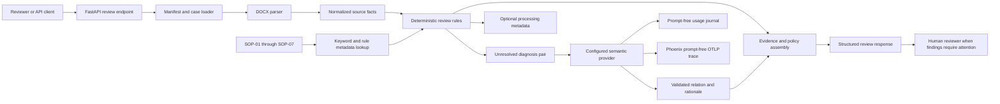

# Architecture

## System boundary

The API accepts a case ID and reads the matching document references from the supplied manifest. DOCX content is parsed into table fields and section text; normalized facts retain source document and raw value. Deterministic rules validate completeness, identity, chronology, procedure support, and diagnosis. Findings are assembled with source evidence and SOP references. The response directs unresolved cases to a human reviewer.

## Processing and decisions

The parser reads DOCX paragraphs and tables; extraction preserves document references and empty field values. Rules do not infer blank claim fields from neighboring documents. Severity/status are fixed enums. Known diagnosis aliases and SOP-defined pairs resolve deterministically. Only unresolved diagnosis pairs reach an explicitly configured self-hosted semantic provider. Its Pydantic-validated output is limited to equivalent, conflict, uncertain or indeterminate; application code owns findings and final status. Outages and invalid output require human review. With fallback disabled, unresolved comparisons escalate without external calls. A missing final record is already a deterministic completeness issue and does not trigger AI inference.

## Policy retrieval tradeoff

Seven small SOPs still use an in-memory loader and rule-category lookup for authoritative policy selection. Compose also builds a Qdrant `policy_chunks` collection from versioned SOP chunks on its first run, using CPU FastEmbed and no patient documents. This prepares semantic policy retrieval without allowing vector search to replace deterministic rule-to-SOP mapping; any future retrieved policy must still be validated and cited.

## Reliability and audit

Pydantic validates output shape; API errors follow Problem Details style and remain separate from clinical findings. Each finding cites its source document and value plus a stable SOP ID. Model telemetry is returned with optional metadata and appended to a local JSONL journal, persisted in a named volume in Compose. Phoenix receives a separate prompt-free OTLP trace with usage, timing, correlation IDs, outcomes, retry counts, and known or estimated cost. Neither destination receives diagnoses, prompts, rationale, source text, patient identifiers, or credentials. HTTP is currently used by the supplied self-hosted endpoint; HTTPS support must be enabled before sending production clinical data. Qdrant persists SOP-only embeddings for future semantic retrieval; the deterministic policy mapping remains authoritative.
