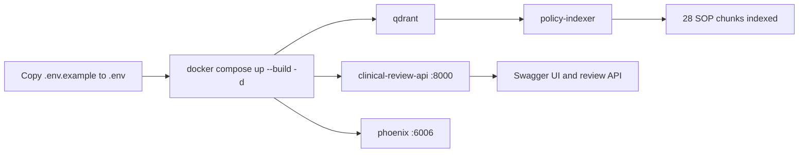

# Runbook

This guide runs the Clinical Document Review Assistant from a fresh clone. Run every command from the `apps` directory, which is the repository root.

## What starts



`policy-indexer` is a one-shot service. An `Exited (0)` status means it completed successfully. The other services continue running.

## Prerequisites

- Docker Desktop with Docker Compose v2 for the full stack.
- Python 3.11 or later for local development and tests.
- Internet access on the first full Compose run so FastEmbed can download its embedding model.
- A self-hosted model API and private bearer token only when semantic fallback is enabled.

## First-time configuration

Create a private configuration file:

```powershell
Copy-Item .env.example .env
```

For deterministic-only review, leave these defaults unchanged:

```dotenv
SEMANTIC_ENABLED=false
LLM_API_KEY=
```

To enable the self-hosted diagnosis comparison, edit private `.env`:

```dotenv
SEMANTIC_ENABLED=true
LLM_BASE_URL=http://your-model-host
LLM_API_KEY=your-private-token
LLM_MODEL=your-exact-model-id
SELF_HOSTED_HOURLY_USD=0.01149
```

`.env` is ignored by Git and Docker build context. Do not commit it or send its token in email, chat, issue trackers, or documentation. See [self-hosted models](012-Self-Hosted-Models.md) to list and switch models.

## Start every service

```powershell
docker compose up --build -d
docker compose ps
```

Wait until `clinical-review-api` reports `healthy`. Expected services:

| Service | Expected status | URL |
|---|---|---|
| `clinical-review-api` | `healthy` | http://127.0.0.1:8000 |
| `qdrant` | `healthy` | Internal only |
| `policy-indexer` | `Exited (0)` | None |
| `phoenix` | `Up` | http://127.0.0.1:6006 |

Check initial SOP indexing:

```powershell
docker compose logs policy-indexer
```

Successful output ends with `Indexed 28 SOP chunks in Qdrant collection 'policy_chunks'.`

## Verify API

```powershell
Invoke-RestMethod http://127.0.0.1:8000/health
```

Expected response:

```json
{"status":"ok"}
```

Open Swagger UI at http://127.0.0.1:8000/docs. Run a supplied case:

```powershell
curl.exe -X POST "http://127.0.0.1:8000/cases/CASE-010/review?include_metadata=true"
```

Use `CASE-001` through `CASE-010`. API responses contain `review_status`, `requires_human_review`, source-backed findings, and SOP references. The service identifies issues for a human reviewer; it does not approve or deny claims.

## Review pipeline

```mermaid
flowchart LR
    A[POST /cases/{case_id}/review] --> B[Manifest and DOCX loading]
    B --> C[Normalize source facts]
    C --> D[Deterministic completeness, identity, chronology, procedure, diagnosis rules]
    D --> E[Evidence and SOP references]
    D --> F{Unmapped diagnosis pair?}
    F -- No --> E
    F -- Yes, model enabled --> G[Self-hosted chat API]
    G --> H[Validate structured relation]
    H --> E
    G --> I[Prompt-free usage journal and Phoenix trace]
    F -- Model disabled or invalid output --> J[needs_review]
    J --> E
    E --> K[Structured review response]
```

Qdrant indexing is separate from current deterministic review decisions. It indexes SOP chunks only and does not index patient case documents.

## Run locally without Docker

```powershell
python -m venv .venv
.\.venv\Scripts\Activate.ps1
python -m pip install -r requirements.txt
uvicorn backend.main:app --reload
```

Then open http://127.0.0.1:8000/docs. Local startup needs no model key when `SEMANTIC_ENABLED=false`.

## Test

```powershell
python -m pytest -q
```

Tests use mocked model transports and do not call the self-hosted model API.

## Use and monitor the self-hosted model

List models configured on the authenticated server:

```powershell
docker compose exec -T clinical-review-api python -m backend.semantic.discover_models
```

Run a synthetic smoke test after changing `LLM_MODEL`:

```powershell
docker compose up -d --force-recreate clinical-review-api
docker compose exec -T clinical-review-api python -m backend.semantic.smoke
```

The smoke test does make a real self-hosted model request. It sends synthetic diagnosis strings and records prompt-free token, latency, outcome, retry, and cost metadata. Review traces at http://127.0.0.1:6006 when `PHOENIX_ENABLED=true`.

Print local usage totals:

```powershell
docker compose exec -T clinical-review-api python -m backend.observability.report --path /srv/apps/telemetry/usage.jsonl
```

## Reindex SOP chunks

After changing `data/policy_chunks.jsonl`, rebuild the Qdrant collection:

```powershell
docker compose run --rm policy-indexer
```

The indexer compares a source fingerprint and skips a current collection. It replaces the collection when SOP chunk content changes.

## Logs and stop

```powershell
docker compose logs -f clinical-review-api
docker compose logs -f policy-indexer
docker compose down
```

To remove containers and persistent Qdrant, Phoenix, telemetry, and embedding-cache volumes:

```powershell
docker compose down -v
```

`down -v` permanently removes local monitoring, usage, Qdrant, and embedding-cache data. It does not modify source files.

## Troubleshooting

| Symptom | Check | Resolution |
|---|---|---|
| Port 8000 unavailable | `docker compose ps -a` | Stop the service using port 8000, then run `docker compose up -d --remove-orphans`. |
| API is not healthy | `docker compose logs clinical-review-api` | Confirm `.env` exists and `BITHEALTH_DATA_DIR` still points to the supplied package. |
| Indexer is running or failed | `docker compose logs policy-indexer` | Check internet access for the first FastEmbed download, then run `docker compose run --rm policy-indexer`. |
| Model smoke check returns `indeterminate` | Smoke-test output | Verify endpoint, key, and exact model ID. Invalid model JSON is intentionally escalated to human review. |
| No Phoenix traces | `docker compose ps` and `.env` | Set `PHOENIX_ENABLED=true`, recreate `clinical-review-api`, and open http://127.0.0.1:6006. |
| Qdrant needs embeddings from self-hosted API | `POST /embeddings` | Current provider returns `501 Not Implemented`; retain local FastEmbed until an embedding endpoint is available. |
